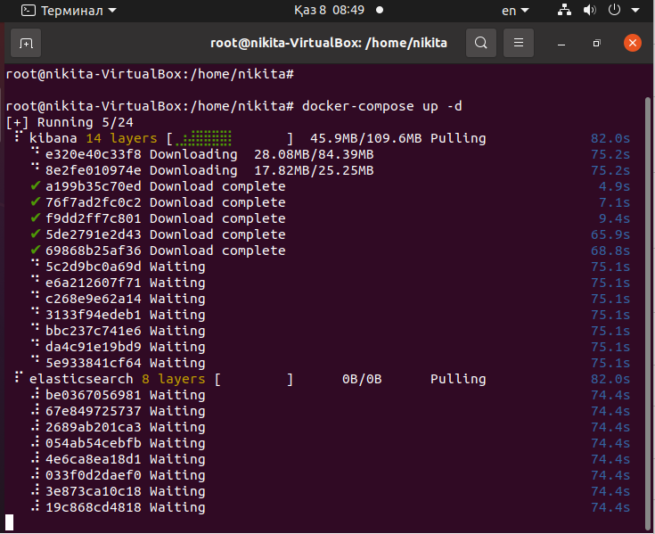

# `Домашнее задание к занятию "ELK"` - `Чичулин Никита SYS-22`

1. [Описание домашнего задания к занятию «ELK»](https://github.com/netology-code/sdb-homeworks/blob/main/11-03.md#домашнее-зада)

---

### [Задание 1. Elasticsearch](https://github.com/netology-code/sdb-homeworks/blob/main/11-03.md#задание-1-elasticsearch)

Установите и запустите Elasticsearch, после чего поменяйте параметр cluster_name на случайный.

*Приведите скриншот команды 'curl -X GET 'localhost:9200/_cluster/health?pretty', сделанной на сервере с установленным Elasticsearch. Где будет виден нестандартный cluster_name*.

### Ответ 1

  
Ответ 1

    1) Установить Docker и Docker Compose
    	sudo apt-get update
		sudo apt-get install docker.io docker-compose -y
    2) создать файл docker-compose.yml
    	Внести в него следующее: 
version: '3'
services:
  elasticsearch:
    image: docker.elastic.co/elasticsearch/elasticsearch:7.10.0
    environment:
      - cluster.name=my-cluster-name # Поменяйте на ваш случайный cluster_name
      - discovery.type=single-node
    ports:
      - "9200:9200"
    networks:
      - elk-network
  kibana:
    image: docker.elastic.co/kibana/kibana:7.10.0
    ports:
      - "5601:5601"
    networks:
      - elk-network
networks:
  elk-network:
    driver: bridge
    3)Поднять docker-compose
    	docker-compose up -d
    

--------

### [Задание 2. Kibana](https://github.com/netology-code/sdb-homeworks/blob/main/11-03.md#задание-2-kibana)

Установите и запустите Kibana.

*Приведите скриншот интерфейса Kibana на странице http://<ip вашего сервера>:5601/app/dev_tools#/console, где будет выполнен запрос GET /_cluster/health?pretty*.

### Ответ 2

  
Ответ 2

  

--------

### [Задание 3. Logstash](https://github.com/netology-code/sdb-homeworks/blob/main/11-03.md#задание-3-logstash)

Установите и запустите Logstash и Nginx. С помощью Logstash отправьте access-лог Nginx в Elasticsearch.

*Приведите скриншот интерфейса Kibana, на котором видны логи Nginx.*

### Ответ 3

  
Ответ 3

    - Запустите memcached с указанием непривилегированного пользователя:
   
    - Установливаем ключи с TTL в 5 секунд:
   
    - Проверяем, что ключи были удалены:
   
    

--------

### [Задание 4. Filebeat.](https://github.com/netology-code/sdb-homeworks/blob/main/11-03.md#задание-4-filebeat)

Установите и запустите Filebeat. Переключите поставку логов Nginx с Logstash на Filebeat.

*Приведите скриншот интерфейса Kibana, на котором видны логи Nginx, которые были отправлены через Filebeat.*

### Ответ 4

  
Ответ 4

   1)Установить Redis 
      	sudo apt install redis-server
   2)Запись данных в Redis:

3)Достаём все записанные ключи и значения:

--------

