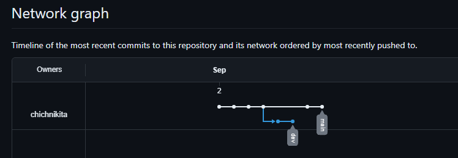

# `Домашнее задание к занятию "Git"` - `Чичулин Никита SYS-22`

1. [Описание домашнего задания к занятию «Git»](https://github.com/netology-code/sdvps-homeworks/blob/main/8-01.md)

---

### Задание 1

`Выполнение заданий показывать скриншотами скриншотами : `

1. Аккаунт создан

2. Галочка проставлена, для создания README

3.  

4. 

5.   

<<<<<<< HEAD
6.   
=======
6. 
>>>>>>> dev

   ### Задание 2
   
   `Выполнение заданий показывать скриншотами скриншотами : `
   
   

<<<<<<< HEAD
  

  

  

### Задание 3

`Выполнение заданий показывать скриншотами скриншотами : `

 

  

[Network graph](https://github.com/chichnikita/student-SYS-22/network)  

 
=======

>>>>>>> dev
