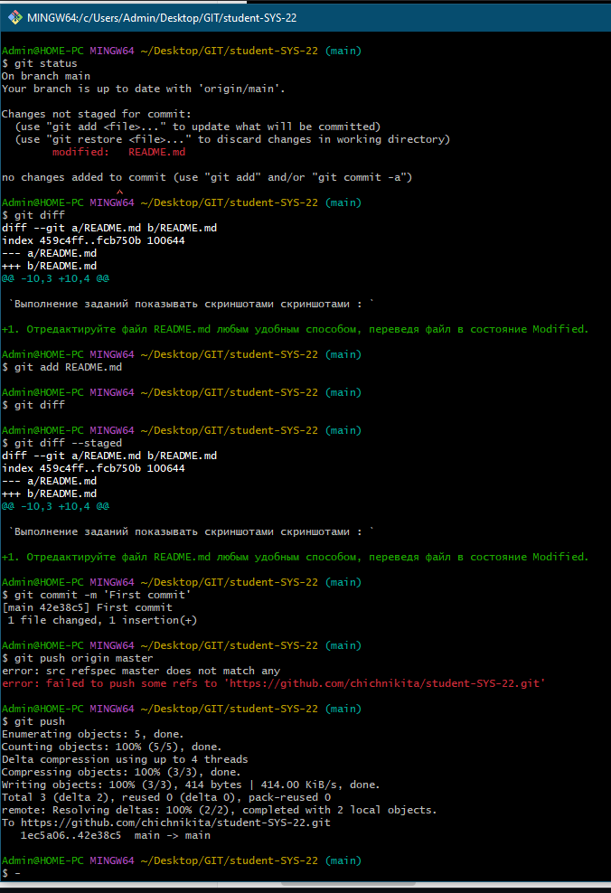

# `Домашнее задание к занятию "Git"` - `Чичулин Никита SYS-22`

1. [Описание домашнего задания к занятию «Git»](https://github.com/netology-code/sdvps-homeworks/blob/main/8-01.md)

---

### Задание 1

`Выполнение заданий показывать скриншотами скриншотами : `

Аккаунт создан

Галочка проставлена, для создания README

Склонировал репозиторий

Произвёл первоначальную настройку Git, указав своё настоящее имя и email

с 6 по 13 пункты :

[Ссылка на последний коммит](https://github.com/chichnikita/student-SYS-22/compare/1ec5a06ba0209f8b77fbbcb5f92279925f724c93...42e38c5e2e66994c54c8d3476384c38e9f85b590)

   ### Задание 2

   `Выполнение заданий показывать скриншотами скриншотами : `

   

<<<<<<< HEAD
  

  

  

[Ссылка на commit](https://github.com/chichnikita/student-SYS-22/compare/a0cc4715e3146f48258aaf77b844e19fed98b560...3342b35fa759649b87b8dff75ae5c0d950b48b62)

### Задание 3

`Выполнение заданий показывать скриншотами скриншотами : `

 

  

[Network graph](https://github.com/chichnikita/student-SYS-22/network)  

 
=======
