# `Домашнее задание к занятию "Очереди RabbitMQ"` - `Чичулин Никита SYS-22`


1. [Описание домашнего задания к занятию «Очереди RabbitMQ»](https://github.com/netology-code/sdb-homeworks/blob/main/11-04.md)

---

### [Задание 1. Установка RabbitMQ](https://github.com/netology-code/sdb-homeworks/blob/main/11-04.md#задание-1-установка-rabbitmq)

Используя Vagrant или VirtualBox, создайте виртуальную машину и установите RabbitMQ. Добавьте management plug-in и зайдите в веб-интерфейс.

*Итогом выполнения домашнего задания будет приложенный скриншот веб-интерфейса RabbitMQ.*


### Ответ 1

<details>
  <summary>Ответ 1</summary>
    1)Установить RabbitMQ
    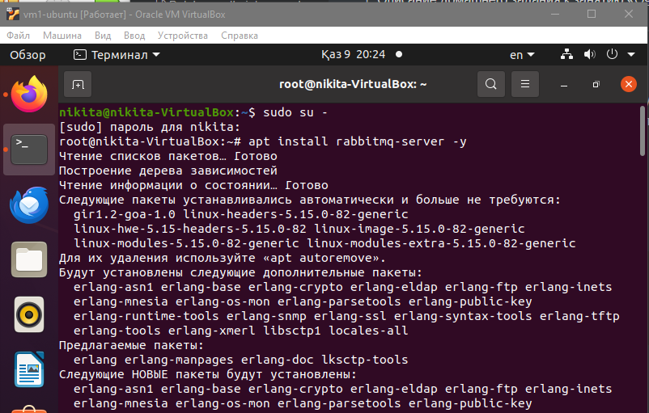
    2)Проверить статус сервиса
    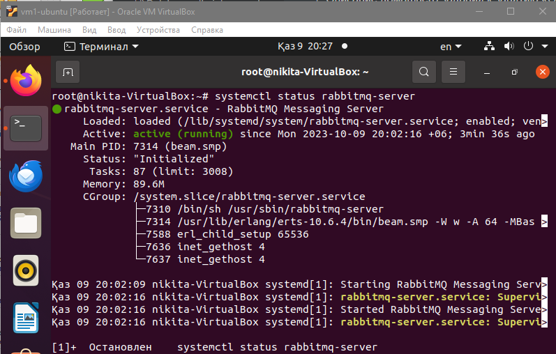
    3)Добавить management plug-in для веб-интерфейса RabbitMQ.
     После включения плагина перезапустите RabbitMQ
    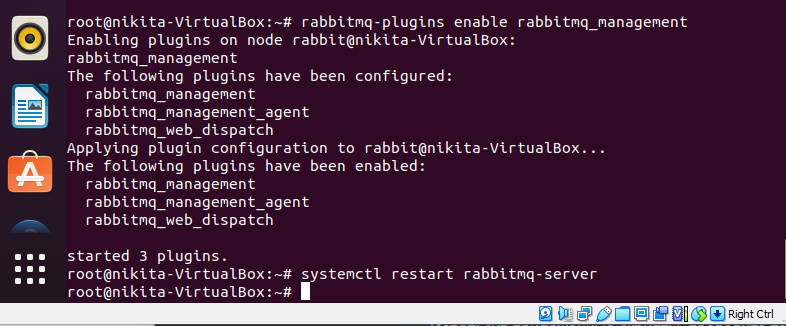
    4)Доступ к веб-интерфейсу RabbitMQ:
    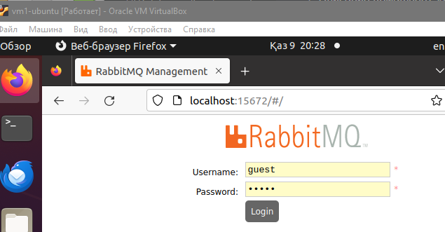
    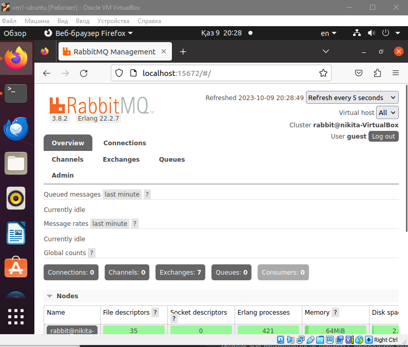
</details>


--------

### [Задание 2. Отправка и получение сообщений](https://github.com/netology-code/sdb-homeworks/blob/main/11-04.md#задание-2-отправка-и-получение-сообщений)

Используя приложенные скрипты, проведите тестовую отправку и получение сообщения. Для отправки сообщений необходимо запустить скрипт producer.py.

Для работы скриптов вам необходимо установить Python версии 3 и библиотеку Pika. Также в скриптах нужно указать IP-адрес машины, на которой запущен RabbitMQ, заменив localhost на нужный IP.

```
$ pip install pika
```


Зайдите в веб-интерфейс, найдите очередь под названием hello и сделайте скриншот. После чего запустите второй скрипт consumer.py и сделайте скриншот результата выполнения скрипта

*В качестве решения домашнего задания приложите оба скриншота, сделанных на этапе выполнения.*

Для закрепления материала можете попробовать модифицировать скрипты, чтобы поменять название очереди и отправляемое сообщение.

### Ответ 2

<details>
  <summary>Ответ 2</summary>
    1)Установка python3 и библиотеку pika
    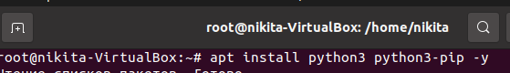
    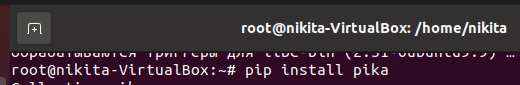
    2)создать скрипты producer.py и consumer.py
    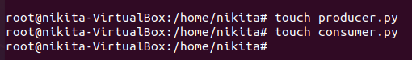
	Скрипт producer.py  :
    import pika
    connection = pika.BlockingConnection(pika.ConnectionParameters('127.0.0.1'))
channel = connection.channel()

channel.queue_declare(queue='hello')
channel.basic_publish(exchange='', routing_key='hello', body='Hello, RabbitMQ!')
print(" [x] Sent 'Hello, RabbitMQ!'")

connection.close()
	

Скрипт comsumer.py  :
import pika

connection = pika.BlockingConnection(pika.ConnectionParameters('127.0.0.1'))
channel = connection.channel()

channel.queue_declare(queue='hello')

def callback(ch, method, properties, body):
    print(f" [x] Received {body}")

channel.basic_consume(queue='hello', on_message_callback=callback, auto_ack=True)

print(' [*] Waiting for messages. To exit press CTRL+C')
channel.start_consuming()
	3)Запуск producer.py и consumer.py:

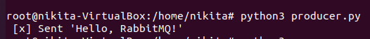

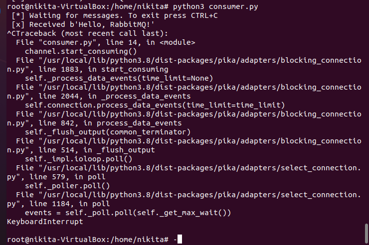
В веб-интерфейсе RabbitMQ очередь с названием hello
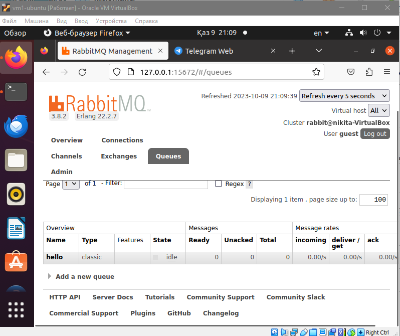
</details>


--------

### [Задание 3. Подготовка HA кластера](https://github.com/netology-code/sdb-homeworks/blob/main/11-04.md#задание-3-подготовка-ha-кластера)

Используя Vagrant или VirtualBox, создайте вторую виртуальную машину и установите RabbitMQ. Добавьте в файл hosts название и IP-адрес каждой машины, чтобы машины могли видеть друг друга по имени.

Пример содержимого hosts файла:

```
$ cat /etc/hosts
192.168.0.10 rmq01
192.168.0.11 rmq02
```


После этого ваши машины могут пинговаться по имени.

Затем объедините две машины в кластер и создайте политику ha-all на все очереди.

*В качестве решения домашнего задания приложите скриншоты из веб-интерфейса с информацией о доступных нодах в кластере и включённой политикой.*

Также приложите вывод команды с двух нод:

```
$ rabbitmqctl cluster_status
```


Для закрепления материала снова запустите скрипт producer.py и приложите скриншот выполнения команды на каждой из нод:

```
$ rabbitmqadmin get queue='hello'
```


После чего попробуйте отключить одну из нод, желательно ту, к которой подключались из скрипта, затем поправьте параметры подключения в скрипте consumer.py на вторую ноду и запустите его.

*Приложите скриншот результата работы второго скрипта.*

### Ответ 3

<details>
  <summary>Ответ 3</summary>
    - Запустите memcached с указанием непривилегированного пользователя:
    </details>

​	1)Настройка файла hosts на обеих машинах:

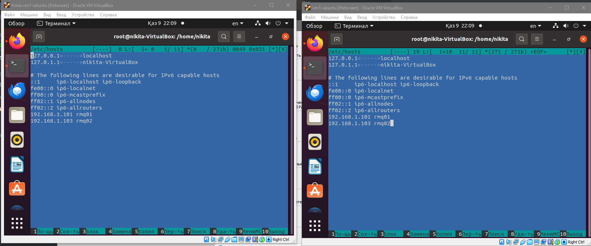

​	2)Объединение машин в кластер:
​		На обеих машинах отредактировал файл конфигурации RabbitMQ (/etc/rabbitmq/rabbitmq.conf):

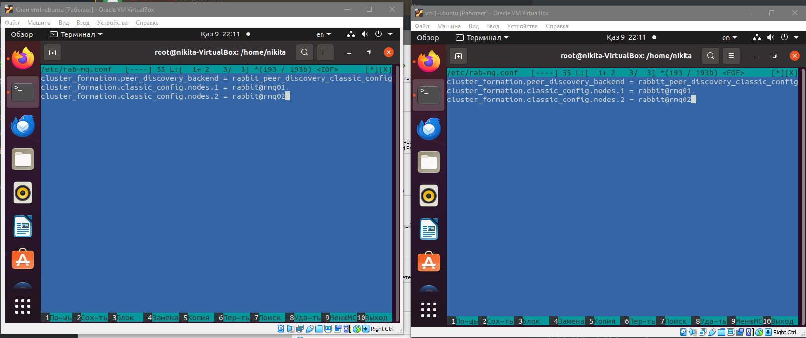

​	3)Перезапустил RabbitMQ на обеих машинах:

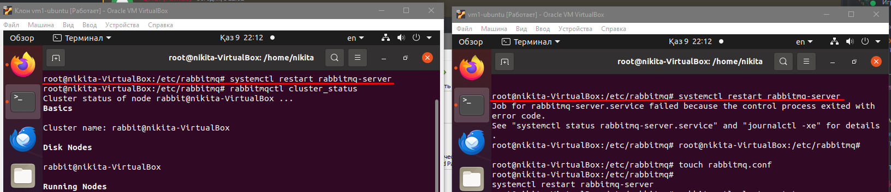

​	4)Создание политики HA на все очереди:

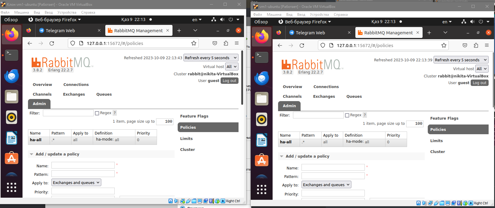

5)Проверка статуса кластера:

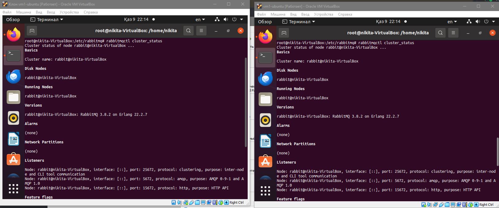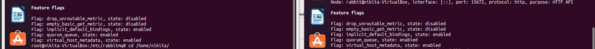

6)Тестирование работы скриптов:
Запустаем producer.py на одной из нод, а затем consumer.py на другой ноде.

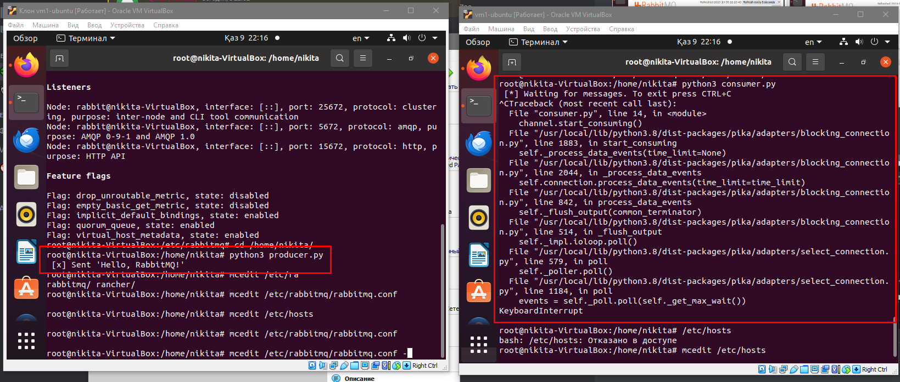


--------


--------


