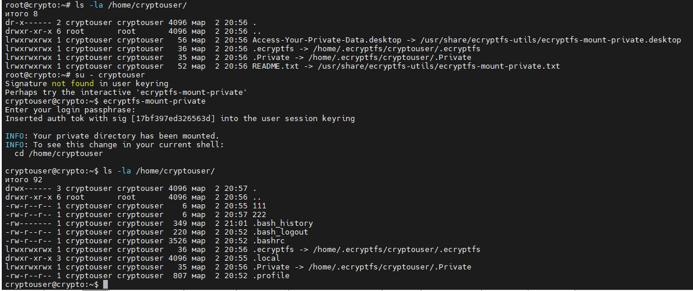
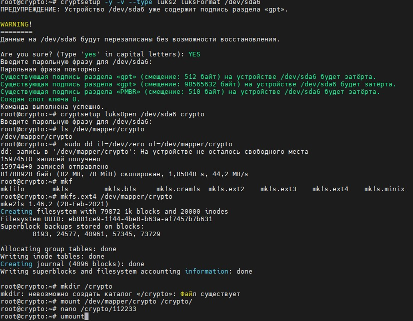

# `Домашнее задание к занятию "Защита хоста"` - `Чичулин Никита SYS-22`


1. [Описание домашнего задания к занятию «Защита хоста»](https://github.com/netology-code/sdb-homeworks/blob/main/13-02.md)

---

 ### Задание 1: 
<details>
   <summary> Задание 1 </summary>

### Задание 1

1. Установите **eCryptfs**.
2. Добавьте пользователя cryptouser.
3. Зашифруйте домашний каталог пользователя с помощью eCryptfs.

*В качестве ответа  пришлите снимки экрана домашнего каталога пользователя с исходными и зашифрованными данными.*  

</details>

### Ответ 1
<details>
  <summary>Ответ 1: </summary>

- поставил пакет **eCryptfs**: `apt install ecryptfs-utils`
- создал пользователя: `adduser cryptouser`
- инициализировал **eCryptfs** для папки пользователя: `ecryptfs-migrate-home -u cryptouser`
- ребутнул сервер: `reboot`
- зашел из под `cryptouser`: `su cryptouser`
- ввел команду: `ecryptfs-mount-private`

Скриншот с тем, как видит эту директорию `cryptouser` и `root`



</details>


--------

 ### Задание 2: 
<details>
   <summary> Задание 2 </summary>
  
### Задание 2

1. Установите поддержку **LUKS**.
2. Создайте небольшой раздел, например, 100 Мб.
3. Зашифруйте созданный раздел с помощью LUKS.

*В качестве ответа пришлите снимки экрана с поэтапным выполнением задания.*

</details>

 ### Ответ 2: 
<details>
   <summary> Ответ 2: </summary>

Застрял долго на команде `cryptsetup -y -v --type luks2 luksFormat`
- На запрос нужно ответить `YES`, а не `yes`
```
Данные на /dev/sda6 будут перезаписаны без возможности восстановления.

Are you sure? (Type 'yes' in capital letters): yes
Операция прервана.

Сбой команды, код -1 (некорректные или отсутствующие параметры).
```
```
Данные на /dev/sda6 будут перезаписаны без возможности восстановления.

Are you sure? (Type 'yes' in capital letters): YES
Введите парольную фразу для /dev/sda6:
Парольная фраза повторно:
Существующая подпись раздела «gpt» (смещение: 512 байт) на устройстве /dev/sda6 будет затёрта.
Существующая подпись раздела «gpt» (смещение: 98565632 байт) на устройстве /dev/sda6 будет затёрта.
Существующая подпись раздела «PMBR» (смещение: 510 байт) на устройстве /dev/sda6 будет затёрта.
Создан слот ключа 0.
Команда выполнена успешно.
```

Для восстановления доступа к разделу после перезапуска вводим команды:
```
cryptsetup luksOpen /dev/sda6 crypto
mount /dev/mapper/crypto /crypto/
```



</details>


--------
